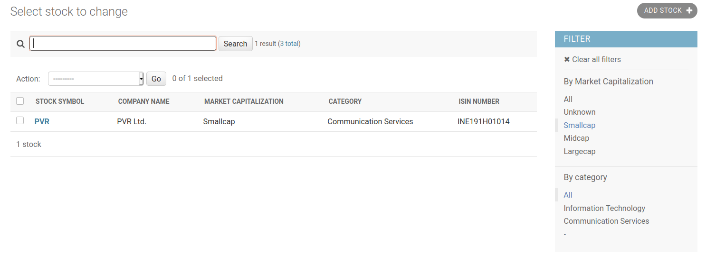

# Django Admin Tutorial

## Installation and Project Setup

Before we start installing django framework, we need to setup a virtual environment.

**Why we need a virtual environment**
The operating systems like Linux and Mac OS uses python internally. So installing other python packages in the default python is not recommended.
The solution to this is to create a python virtual environment. When we create a virtual environment, the python binaries is copied to a new folder. Anything we install in this virtual environment will installed in this python folder.

The following command will create a virtual environment and activates it.

``` bash
python3 -m venv .env

source  .env/bin/activate
```

Now lets install django

``` bash
pip install django
```

To create a project run this command

``` bash
django-admin startproject my_stocks
```

The **startproject** command will create the following configuration files in your current directory.

``` bash
.
├── manage.py # <--- Utility file for administrative tasks
└── my_stocks
   ├── asgi.py
   ├── __init__.py
   ├── settings.py # <--- File in which all the important settings are stored.
   ├── urls.py
   └── wsgi.py
```

Now lets run the project by running this command.

``` bash
python manage.py runserver
```

Now open the browser and browse http://localhost:8000 or http://127.0.0.1:8000 and you should be getting following screen:

**NOTE:** To stop the running application press **Ctrl + C**


## Login to Django Admin

To use the Django's admin portal, we need to initialize our database and create a super user account.

First stop the application by pressing **Ctrl + C** and run the following commands:

``` bash
python manage.py migrate

python manage.py createsuperuser
```

Here, the **migrate** command will create necessary database table to be used by the django framework.[Default database for Django is SQLite]

The **createsuperuser** command is to create a super user. This command will prompt some details like username, email and password.

Once you complete creating the super user, start the application by running ```python manage.py runserver``` command and browse http://localhost:8000/admin 

You will got a login screen like the following


Now login with the username and password of the super user and you will redirected to the admin index page.


Here only the **Authentication and Authorization** section will be present which is the Django's default pages to manage user and permissions.

## Create an app

To create our for application run the following command:

``` bash
python manage.py startapp stock
```

**startapp** command will create separate folder in our project directory.

``` bash
.
├── manage.py
├── my_stocks
│   ├── asgi.py
│   ├── __init__.py
│   ├── settings.py
│   ├── urls.py
│   └── wsgi.py
├── README.md
└── stock # <--- New application folder
    ├── admin.py # <--- File to control model display in the admin site.
    ├── apps.py
    ├── __init__.py
    ├── migrations
    │   └── __init__.py
    ├── models.py # <--- File to store the model information.
    ├── tests.py
    └── views.py
```

Next step after creating app is to add it in the ```my_stocks/settings.py``` so that django can recognize it.

Open the ```my_stocks/settings.py``` add add our application name in the setting as shown below.

``` python
INSTALLED_APPS = [
    'django.contrib.admin',
    'django.contrib.auth',
    'django.contrib.contenttypes',
    'django.contrib.sessions',
    'django.contrib.messages',
    'django.contrib.staticfiles',
    'stock' # <--- Add the app name here
]
```

## Defining Model and Registering it in Admin site

Model in django is mapped to a single table in a database. Each attribute of the model class represents a database field.

To define our model, lets open the ```stock/models.py``` and add the following:

``` python
# stock/models.py

from django.db import models

class Category(models.Model):
    name = models.CharField(
        max_length=100,
        unique=True,
        verbose_name="Stock Category")

    def __str__(self):
        return self.name

class MarketCapitalization(models.TextChoices):
    UNKNOWN = ("U", "Unknown")
    SMALL = ("S", "Smallcap")
    MID = ("M", "Midcap")
    LARGE = ("L", "Largecap")

class Stock(models.Model):
    name = models.CharField(max_length=100, verbose_name="Company Name")
    symbol = models.CharField(max_length=10, verbose_name="Stock Symbol")
    listing_date = models.DateField(verbose_name="Stock Listing Date")
    isin = models.CharField(max_length=20, unique=True, verbose_name="ISIN Number")
    market_cap = models.CharField(
        max_length=1,
        choices=MarketCapitalization.choices,
        default=MarketCapitalization.UNKNOWN,
        verbose_name="Market Capitalization"
    )
    category = models.ForeignKey(Category, on_delete=models.PROTECT, null=True, blank=True)


    def __str__(self):
        return f"{self.name}({self.symbol})"

```

Next we have to make these model changes into our database for that run the following:

``` bash
python manage.py makemigrations # <--- This command will create a script to create table in database

python manage.py migrate # <--- This will execute the scripts created by the above makemigration command
```


Finally to list our model in the admin site we have to register in from the ```stock/admin.py``` like the following:

``` python
# stock/admin.py

from django.contrib import admin
from stock.models import Stock, Category

class CategoryAdmin(admin.ModelAdmin):
    pass

class StockAdmin(admin.ModelAdmin):
    pass


admin.site.register(Stock, StockAdmin)
admin.site.register(Category, CategoryAdmin)
```

Now run start the application and browse the admin site and you should get a screen like this:


## Enabling List, Sort, Search and Filter

Let's add some data see how it is listed in the stocks page.

Click on the "ADD STOCK" button add a stock data.


The list is currently showing only the string representation of the **stock.models.Stock** model class.

To list the fields from the models, we have to add [list_display](https://docs.djangoproject.com/en/3.2/ref/contrib/admin/#django.contrib.admin.ModelAdmin.list_display) property our **stock.admin.StockAdmin** model admin class.

``` python
# stock/admin.py

from django.contrib import admin
from stock.models import Stock, Category

class CategoryAdmin(admin.ModelAdmin):
    pass

class StockAdmin(admin.ModelAdmin):
    list_display = ("symbol", "name", "market_cap", "category", "isin") # <--- Add this to your code


admin.site.register(Stock, StockAdmin)
admin.site.register(Category, CategoryAdmin)
```

Now go back to browser and refresh the site, the given fields will be listed with sorting functionality.


Now we need to enable search functionality. For that we cab use the [search_fields](https://docs.djangoproject.com/en/3.2/ref/contrib/admin/#django.contrib.admin.ModelAdmin.search_fields) property. Note that django will perform search only in the fields listed in the [search_fields](https://docs.djangoproject.com/en/3.2/ref/contrib/admin/#django.contrib.admin.ModelAdmin.search_fields) property.

``` python
# stock/admin.py

from django.contrib import admin
from stock.models import Stock, Category

class CategoryAdmin(admin.ModelAdmin):
    pass

class StockAdmin(admin.ModelAdmin):
    list_display = ("symbol", "name", "market_cap", "category", "isin")
    search_fields = ("name", "symbol", "isin") # <--- Add this to your code


admin.site.register(Stock, StockAdmin)
admin.site.register(Category, CategoryAdmin)
```


Finally lets add a few filter to the page using the [list_filter](https://docs.djangoproject.com/en/3.2/ref/contrib/admin/#django.contrib.admin.ModelAdmin.list_filter) property.

``` python
# stock/admin.py

class StockAdmin(admin.ModelAdmin):
    list_display = ("symbol", "name", "market_cap", "category", "isin")
    search_fields = ("name", "symbol")
    list_filter = ("market_cap", "category") # <--- Add this to your code

```



## Add a custom page to the admin site

To add a custom page to the admin we have use the [get_urls](https://docs.djangoproject.com/en/3.2/ref/contrib/admin/#django.contrib.admin.ModelAdmin.get_urls) method.

Modify the **StockAdmin** class to add a new url and a view function to render its contents.

``` python
# stock/admin.py

class StockAdmin(admin.ModelAdmin):
    list_display = ("symbol", "name", "market_cap", "category", "isin")
    search_fields = ("name", "symbol", "isin")
    list_filter = ("market_cap", "category")

    def get_urls(self): # <--- Adds our custom url to the admin page.
        urls = super().get_urls()
        my_urls = [
            path('upload-stock-data/', self.admin_site.admin_view(self.upload_stock_data), name="upload"),
        ]
        return my_urls + urls

    def upload_stock_data(self, request): # <--- Function to render the contents for the new url
        context = dict(
            # Include common variables for rendering the admin template.
            self.admin_site.each_context(request),
        )

        return render(request, 'upload-stock-data.html', context)
```

Now we have to create an empty file named **upload-stock-data.html** in a new directory named **templates** at the project root.

``` bash
.
├── db.sqlite3
├── manage.py
├── my_stocks
├── stock
│   ├── admin.py
|   .
└── templates # <--- New directory
    └── upload-stock-data.html # <--- New template file
```

Lets add some content to the **templates/upload-stock-data.html** file:

``` html



    <h1>Upload Stock Data</h1>
    <form action="." method="post" enctype="multipart/form-data">
        
        <input type="file" name="stock_data" id="stock_data" accept=".csv">
        <button type="submit">Submit</button>
    </form>

```

To test the new url, browse http://127.0.0.1:8000/admin/stock/stock/upload-stock-data/ and you should get an error page.


The error occurred because we didn't configure the django where to look for the templates.

Lets add the template path in the **my_stocks/settings.py**

``` python
TEMPLATES = [
    {
        'BACKEND': 'django.template.backends.django.DjangoTemplates',
        'DIRS': [BASE_DIR / 'templates'], # <--- Add the template path like this
        'APP_DIRS': True,
        'OPTIONS': {
            'context_processors': [
                'django.template.context_processors.debug',
                'django.template.context_processors.request',
                'django.contrib.auth.context_processors.auth',
                'django.contrib.messages.context_processors.messages',
            ],
        },
    },
]
```

Now reload the url and you should see the actual page like this


The html that we added in the **templates/upload-stock-data.html** file is a form to upload a csv file.

Lets modify the **upload_stock_data** method in the **StockAdmin** to read and create **Stock** data from the csv file.

``` python
# stock/admin.py

class StockAdmin(admin.ModelAdmin):
    list_display = ("symbol", "name", "market_cap", "category", "isin")
    search_fields = ("name", "symbol", "isin")
    list_filter = ("market_cap", "category")

    def get_urls(self): # <--- Adds our custom url to the admin page.
        urls = super().get_urls()
        my_urls = [
            path('upload-stock-data/', self.admin_site.admin_view(self.upload_stock_data), name="upload"),
        ]
        return my_urls + urls

    def upload_stock_data(self, request): # <--- Function to render the contents for the new url
        context = dict(
            # Include common variables for rendering the admin template.
            self.admin_site.each_context(request),
        )

        if request.method == "POST": # <--- New logic to read the uploaded csv and create Stock data
            stocks = []

            file = request.FILES['stock_data']
            decoded_file = file.read().decode('utf-8').splitlines()
            reader = csv.reader(decoded_file)
            next(reader) # Skipping header rows
            for row in reader:
                stock = Stock(
                    symbol=row[0],
                    name=row[1],
                    listing_date=datetime.strptime(row[2], "%d-%b-%Y").date(),
                    isin=row[3]
                )

                market_cap = row[4].strip().lower()
                if market_cap == 'smallcap':
                    stock.market_cap = MarketCapitalization.SMALL
                elif market_cap == 'midcap':
                    stock.market_cap = MarketCapitalization.MID
                elif market_cap == 'largecap':
                    stock.market_cap = MarketCapitalization.LARGE
                else:
                    stock.market_cap = MarketCapitalization.UNKNOWN

                category, created = Category.objects.get_or_create(name__iexact=row[5], defaults={'name': row[5]})
                stock.category = category

                stocks.append(stock)

            Stock.objects.bulk_create(stocks)

            # Redirect user to admin index page completing the upload
            return redirect(reverse_lazy('admin:index'))

        return render(request, 'upload-stock-data.html', context)
```
